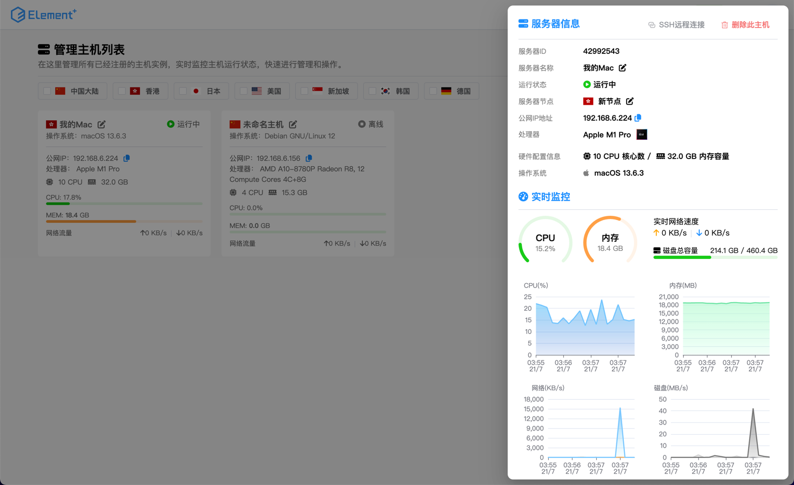

## 使用Springboot+Vue实现的服务器监控系统

本系统分以下模块

- 服务端：负责与前端联动，同时负责收集由客户端发送的服务器运行信息
- 客户端：用于被监控机上运行，通过不断收集宿主机的数据上报给服务端
- 前端：负责展示所有服务器数据

主要技术栈：

- 采用SpringBoot 3最新版作为基础框架
- 采用oshi框架实现跨平台硬件实时运行数据读取
- 采用SpringQuartz实现定时任务调度
- 采用JSON文件格式存储服务端连接信息
- 采用JSCH框架实现远程SSH连接
- 采用WebSocket与前端对接实现前端Shell操作
- 采用InfluxDB实现服务器监控历史信息存储效率更高
- 采用Mybatis-Plus作为持久层框架，使用更便捷
- 采用Redis存储注册/重置操作验证码，带过期时间控制；进行IP地址限流处理
- 采用RabbitMQ积压短信发送任务，再由监听器统一处理
- 采用SpringSecurity作为权限校验框架，手动整合Jwt校验方案
- 使用Swagger作为接口文档自动生成，已自动配置登录相关接口
- 采用Xterm.js作为前端伪终端实现
- 子账户权限控制
- 暗黑模式适配

### 截图展示

待办：
- 关机、重启功能
- FTP文件浏览功能
- 密钥登录
- GlobalAccessToken